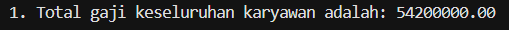
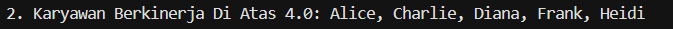
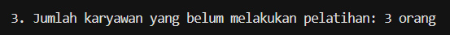
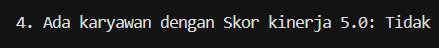
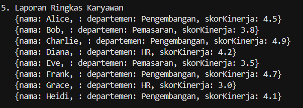
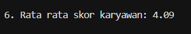
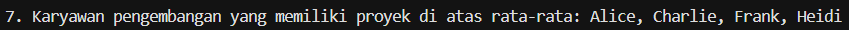
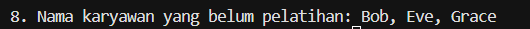

### 1. Dari data tersebut buat syntax/program dart menggunakan perulangan, untuk menemukan jawaban dari pertanyaan:
a. Berapa total gaji keseluruhan karyawan?  

b. Siapa saja karyawan yang memiliki kinerja diatas 4.0?  

c. Berapa jumlah karyawan yang belum melakukan pelatihan?  

d. Apakah ada karyawan yang memiliki nilai kinerja sempurna (5.0)?  

e. Membuat laporan ringkasan masing-masing karyawan yang terdiri nama, departemen, dan skor kinerja.  

f. Berapa skor rata-rata projek dari keseluruhan karyawan?  

g. Siapa saja karyawan pengembangan yang memiliki projek diatas rata-rata?  

h. Siapa saja karyawan yang belum melakukan pelatihan?  

### 2. Berikan tanggapan untuk setiap perulangan dan kapan perulangan tersebut baik untuk digunakan?
  - **For tradisional** dipakai ketika kita ingin mengakses elemen dan mengontrolnya menggunakan indeks. Bisa pakai `continue` dan `break`, serta perulangannya bisa kita tentukan.
  - **For-in** dipakai ketika kita tidak membutuhkan indeks, cocok untuk melakukan sesuatu pada semua elemen.
  - **While loop** dipakai ketika kita tidak tahu mau loop berapa kali. Berjalan sampai kondisi berhenti, tapi bisa terjadi infinite loop.
  - **Do-while** digunakan ketika kita ingin melakukan perulangan minimal satu kali.
  - **forEach** cocok untuk iterasi yang tidak butuh kontrol, tapi tidak bisa menggunakan `break` atau `continue`.
  - **map()** cocok untuk transformasi data, tapi kurang ideal untuk logika kompleks.
